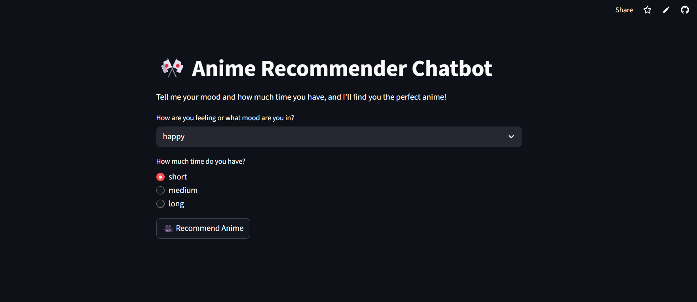

# 🎌 Anime Recommender Chatbot

A fun and intelligent **mood + time-based anime recommendation chatbot** built using **Streamlit** and the **AniList GraphQL API**. This chatbot helps users discover anime tailored to how they feel and how much time they have to watch.

---
🔗 **[Live Demo »](https://varenyavisen-mood--chan-chatbot-app-nmbivp.streamlit.app/)**
## 💡 Motivation

Anime recommendations are often generic, but fans want personalized suggestions. This chatbot was built with the idea of:
- Making anime discovery **personal, smart, and mood-aware**
- Giving users suggestions based on **their emotional state and availability**
- Providing an intuitive and clean **web UI anyone can use**

Built as part of my **AI/ML internship project at Kodacy**, this chatbot integrates real-time data with emotional intelligence—showcasing a blend of **API integration, UX design, and logic-based filtering**.

---

## ✨ Features

✅ Mood-based filtering: happy, sad, bored, romantic, angry, excited, chill  
✅ Time-based filtering: short (≤12 eps), medium (13–25), long (26+ or unknown)  
✅ Intelligent handling of unknown episode counts  
✅ Real-time anime data using the **AniList API**  
✅ Clean and interactive UI built with **Streamlit**  
✅ Fully open-source & ready for deployment  

---

## 🧠 Tech Stack

| Layer            | Tools / Libraries                          |
|------------------|--------------------------------------------|
| Frontend UI      | `Streamlit`                                |
| Backend Logic    | `Python`, `Requests`, custom utils         |
| External API     | `AniList GraphQL API`                      |
| Deployment Ready | `Streamlit Cloud` or `GitHub + Docker`     |
| Dev Tools        | `Git`, `venv`, `requirements.txt`          |

---

## 🎯 How It Works

1. **User selects their mood** → e.g., “sad”, “happy”
2. **User selects time availability** → “short”, “medium”, or “long”
3. The app fetches top anime from **AniList API**
4. Anime are **filtered by mood tags and episode count**
5. Clean card-style results are shown with:
   - English/Romaji title
   - Average Score
   - Genres
   - Number of Episodes

If no match is found, the bot replies smartly with a fallback message.

---

## 📸 Screenshots

 <!-- Replace with your actual screenshot path -->

---
